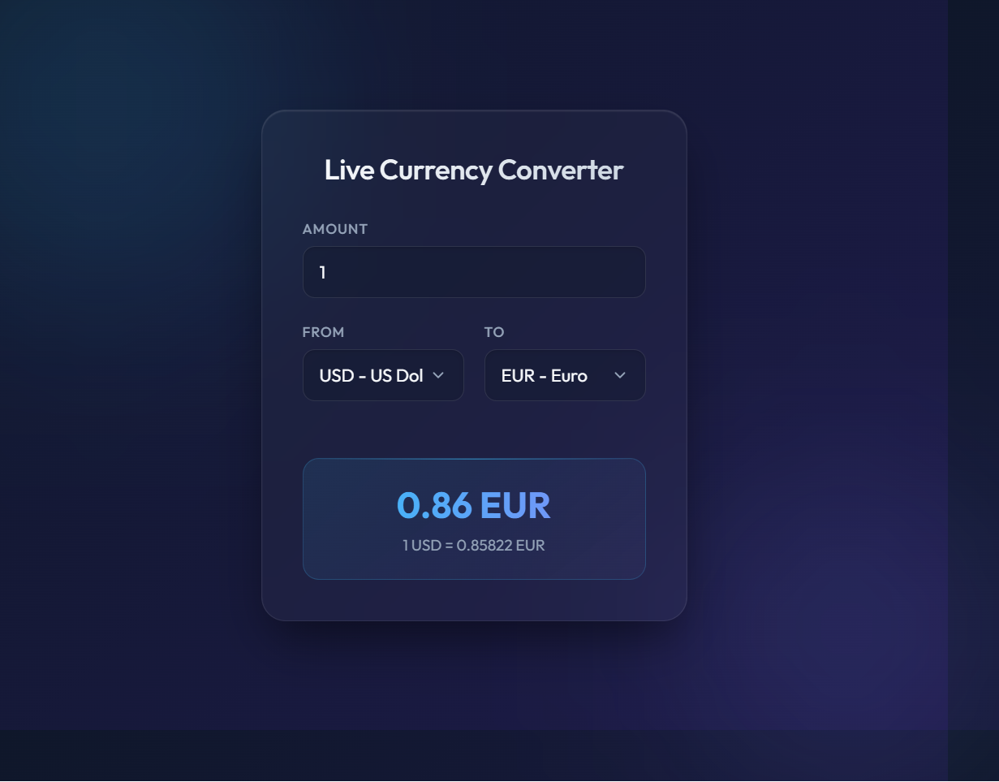

# Currency Converter

This project is a small web application that converts an amount from one currency to another. I built it to practise connecting a frontend to a backend and using data from an external API.

The application supports these currencies:

- USD - US Dollar
- EUR - Euro
- GBP - British Pound
- JPY - Japanese Yen
- PHP - Philippine Peso

## Frontend snapshot

This is what the currency converter looks like in the browser:



## How it works

1. The user enters an amount and chooses the starting and target currencies.
2. The frontend waits briefly while the user is typing, then sends the values to the server.
3. The Express server checks that the amount is a valid number greater than zero.
4. The server requests the latest exchange rate from the [Frankfurter API](https://www.frankfurter.app/).
5. The converted amount is rounded to two decimal places and returned as JSON.
6. The page displays both the converted amount and the exchange rate without reloading.

If both selected currencies are the same, the server returns the original amount with an exchange rate of `1`. This avoids making an unnecessary external request.

## Technologies used

- **HTML** creates the form, number input, currency dropdowns, and result area.
- **CSS** controls the layout, colours, spacing, and responsive appearance.
- **JavaScript** reads the form values, sends requests, and updates the result on the page.
- **Node.js and Express** serve the website and provide the conversion endpoint.
- **Frankfurter API** supplies the latest exchange rates.

## Project structure

```text
currency-converter/
├── public/
│   ├── app.js       # Frontend conversion logic
│   ├── index.html   # Page structure
│   └── style.css    # Page styling
├── server.js        # Express server and API route
├── package.json     # Project information and dependencies
└── README.md        # Project documentation
```

## Requirements

- Node.js 18 or newer, because the server uses the built-in `fetch` function.
- An internet connection, because exchange rates come from the Frankfurter API.

## Running the project

1. Open a terminal in the `currency-converter` folder.
2. Install the dependencies:

	```bash
	npm install
	```

3. Start the server:

	```bash
	node server.js
	```

4. Open [http://localhost:3000](http://localhost:3000) in a browser.

The server uses port `3000` by default. A different port can be selected by setting the `PORT` environment variable.

## API endpoint

The backend provides this endpoint:

```text
GET /api/convert?from=USD&to=EUR&amount=100
```

For a successful request, the response contains the original amount, the two currency codes, the exchange rate, and the converted result. Invalid amounts return an error, and problems contacting the exchange-rate service return a server error message.

## Possible improvements

Some ideas for future versions are adding more currencies, showing the time when the rate was updated, adding a swap-currencies button, and writing automated tests for the server endpoint.
